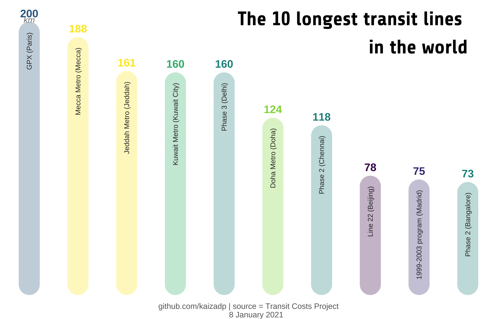
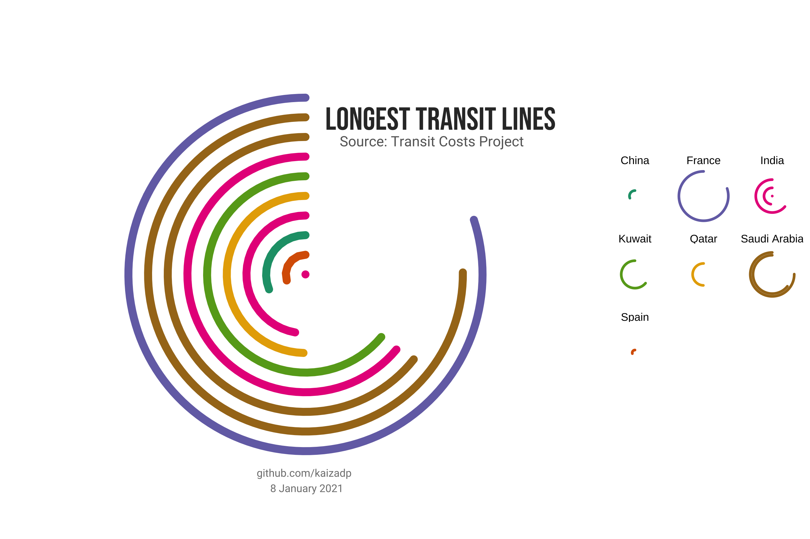
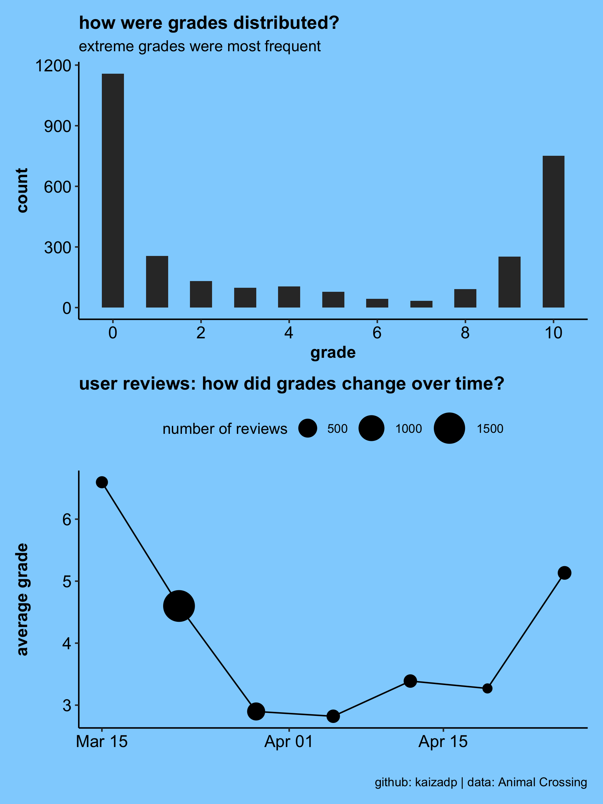
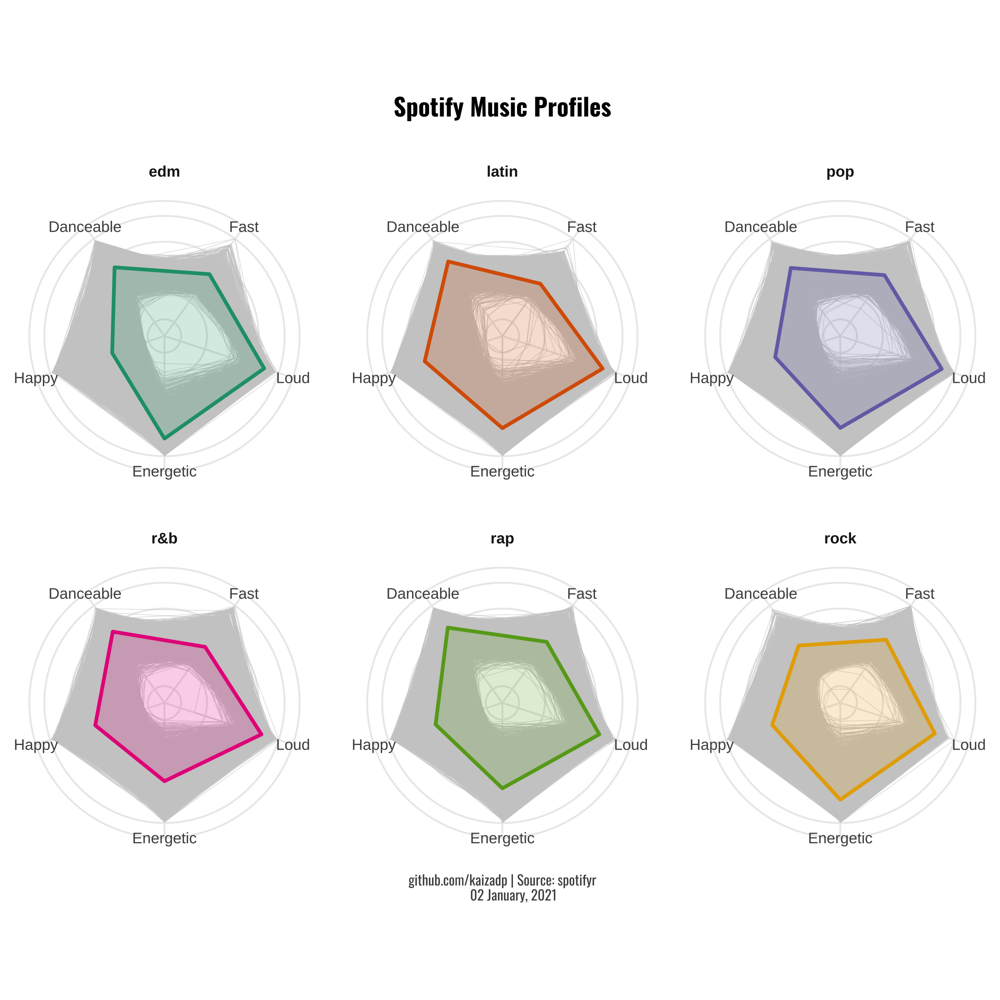
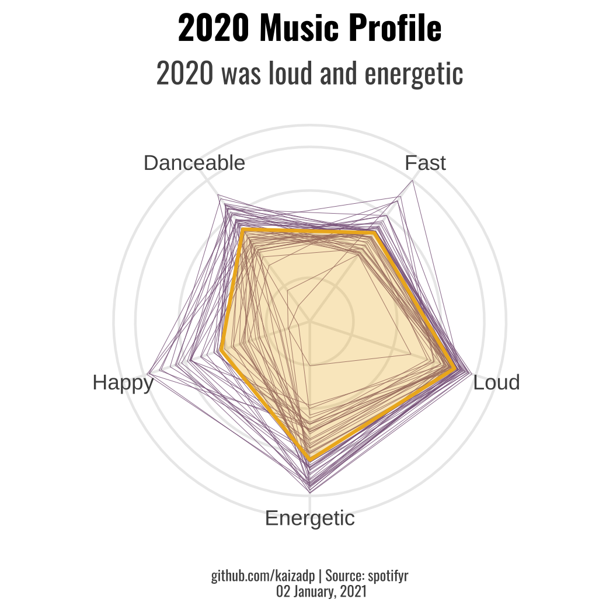

# tidytuesday_kp
Projects for the [#TidyTuesday challenge](https://github.com/rfordatascience/tidytuesday).  

----

## January 05, 2021: [Transit Costs Project](https://github.com/rfordatascience/tidytuesday/tree/master/data/2021/2021-01-05)

## December 22, 2020: [Big Mac Index](https://github.com/rfordatascience/tidytuesday/tree/master/data/2020/2020-12-22)
Data visualization inspired by [AndyABaker](https://github.com/AndyABaker/TidyTuesday/blob/main/2020_week52_bigmac.R), [botan](https://github.com/botan/tidytuesday/blob/main/R/2020-w52-bigmac.Rmd), [kaustavSen](https://github.com/kaustavSen/tidytuesday/blob/master/2020/week_52_big_mac.Rmd)

## May 25, 2020: [Cocktails](https://github.com/rfordatascience/tidytuesday/blob/master/data/2020/2020-05-26/readme.md)

## May 11, 2020: [Volcano Eruptions](https://github.com/rfordatascience/tidytuesday/blob/master/data/2020/2020-05-12/readme.md)

## May 05, 2020: [Animal Crossing](https://github.com/rfordatascience/tidytuesday/blob/master/data/2020/2020-05-05/readme.md)

## April 28, 2020: [Broadway Musicals](https://github.com/rfordatascience/tidytuesday/blob/master/data/2020/2020-04-28/readme.md)

## January 21, 2020: [Spotify](https://github.com/rfordatascience/tidytuesday/tree/master/data/2020/2020-01-21)
Inspired by [jakelawlor](https://github.com/jakelawlor/TidyTuesday_JL/blob/master/CodeFiles/Jan21.20.Spotify.Rmd)

